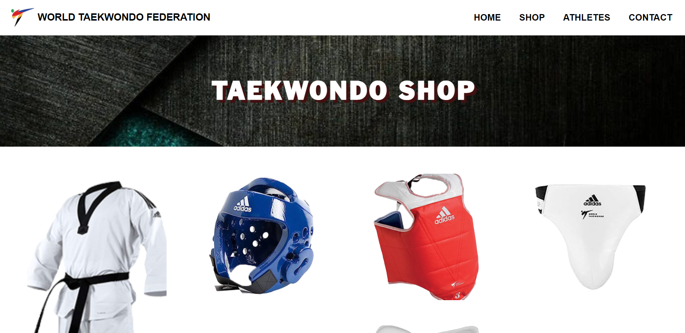
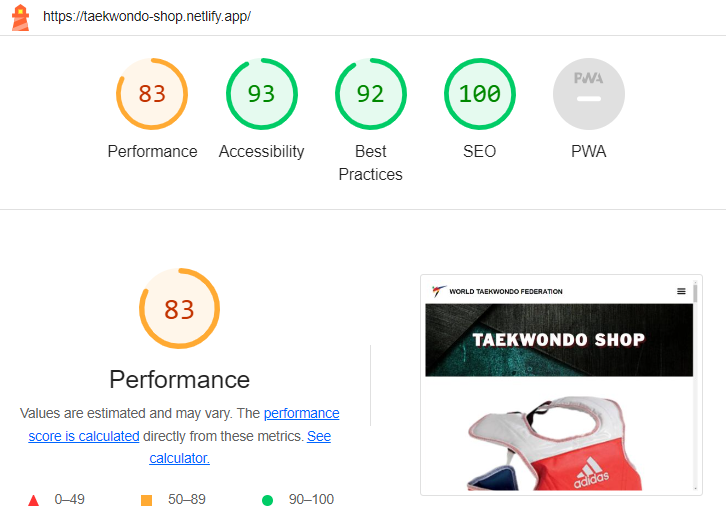

<!--  -->

# Week-3 RevoU Assignment 👨‍💻

## Hi semua, Saya Alyuza Satrio Prayogo 👋
Pada tugas minggu ke-3 ini saya membuat website E-Comerce fokus pada penjualan alat-alat beladiri Taekwondo.
Semua tugas intermediate sudah dikerjakan, dari @font-face, text-shadow, responsive background-image (contain or cover), responsive image with picture + source + srcset, Asymmetric Grid, advanced form element, simple animation and transition.

### Website Navigation
- Home
- Shop
- Athletes Profile
- Contact

Menu `Home` terhubung dengan link tugas Week ke-2
Menu `Shop` terhubung dengan link tugas Week ke-3
## Komponen Yang Digunakan
- HTML 
- CSS
- Assets (Picture)
- Fonts

## Hasil Tampilan Website

## Skor Google Lighthouse

## Deployment [Link](https://taekwondo-shop.netlify.app/) Here !