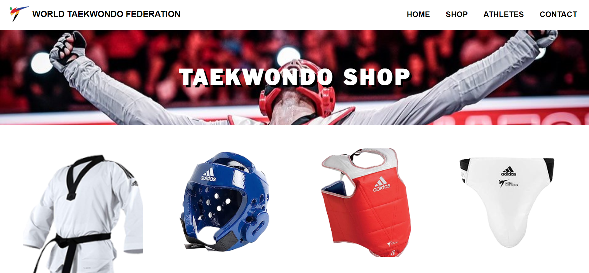

<!--  -->

# Week-3 RevoU Assignment 👨‍💻

## Hi semua, Saya Alyuza Satrio Prayogo 👋
Pada tugas minggu ke-3 ini saya membuat website online shop yang menjual alat-alat Taekwondo, website ini terhubung dengan assignment minggu ke-2 saya.

Di minggu ke-3 ini saya ditugaskan untuk membuat website yang menggunakan beberapa skill yang telah dipelajari, yaitu :
1. Menggunakan @font-face
2. Menggunakan Text-shadow
3. Membuat responsive Background Image (contain / cover)
4. Membuat responsive Image (picture + source + srcset)
5. Membuat sebuah Asymmetrical Grid
6. Membuat form yang menggunakan setidaknya 1 dari (date, color, local date, range picker)
7. Membuat simple animation dan transition

### WEBSITE LAYOUT
- Home
- Shop
- Athletes Profile
- Contact

Menu `Home` terhubung dengan link tugas Week ke-2
Menu `Shop` terhubung dengan link tugas Week Ke-3
## KOMPONEN YANG DIGUNAKAN
- HTML 
- CSS
- Assets (Picture)
- Fonts

## HASIL TAMPILAN WEBSITE

## DEPLOYMENT LINK

Click [here](https://taekwondo-shop.netlify.app/) to see my Project 